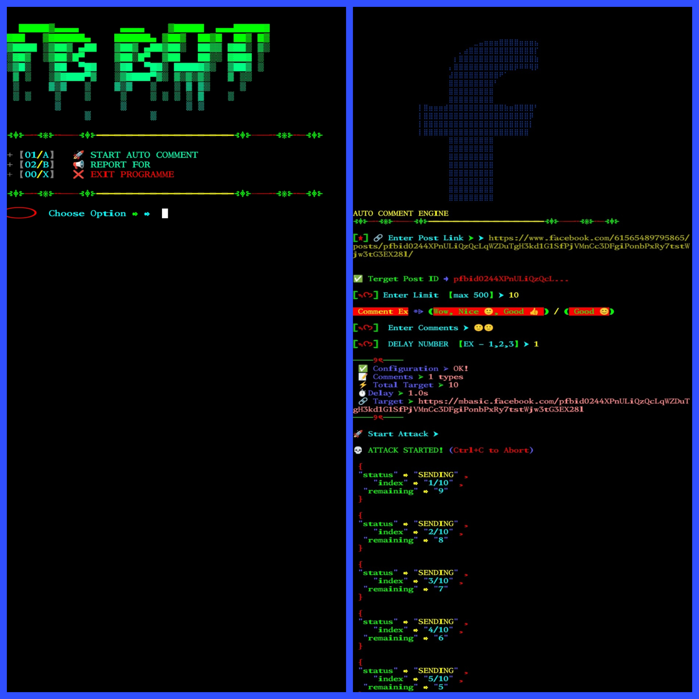

# Facebook Auto Comment 

<p align="center">
</p>


<h2 align="center">FB POST AUTO COMMENT</h2>

<div align="center">
  <a href="https://github.com/Xylon-404/Fb_bot/stargazers">
    
  </a>
  <a href="https://github.com/Xylon-404/Fb_bot/network/members">
    
  </a>
  <a href="https://github.com/Xylon-404/Fb_bot/issues">
    
  </a>
</div>

<div align="center">
  <a href="https://github.com/Xylon-404/Fb_bot/pulls">
    
  </a>
  <a href="https://github.com/Xylon-404/Fb_bot/archive/refs/heads/master.zip">
    
  </a>
</div>
## Language</br>

 <p align="center">
 
> [!INFORMATION]
> A Facebook post AUTO comment is an automated tool that interacts with users on Facebook posts. It can post content, reply to comments, and enhance engagement.

<br>
<h4 align="left">About > </h4><br>

* Unlimited Usage !
* Support Newest Android also
* Working Apis
* Working with all Oparetors/Carriers
<br>
<h4 align="left">TESTED ON > </h4><br>

* Kali Linux
* Termux
* Mac os
* Ubuntu
* Perrot Sec OS

## Contributing
Feel Free To Clone This Project. For Major Changes, Please Open An Issue First To Discuss What You Would Like To Change Or Add, Thank You!!.

## Requirements 
```
python-3
pip
Internet Connection
And some other python packages
``` 
### Install Requirements (on Linux/Termux)

```python
>> pip insall bs4
```
### INSTALLATION >
```python
apt update && apt upgrade -y
pkg install git
pkg install python3 -y
pip install requests
pip install bs4
rm -rf Fb_bot
git clone --depth=1 https://github.com/Xylon-404/Fb_bot.git
cd Fb_bot
chmod +x *
python3 fb_bot.py
```
<p align="center">

<h3 align="center"><b>TERMUX > </b></h3>

<p align="center">


<h2 align="center">LICENSE</h2>

FB AUTO COMMENT is released under the AGPL-3.0 license, which grants the following permissions:
- Commercial use
- Modification
- Distribution
- Patent use
- Private use

For more convoluted language, see the [LICENSE](/LICENSE).
</br>

# Report bugs
If you notice issues while installing this tool or running this tool kindly mail to me at <a href="mailto: info@one-x.top">Gmail</a> or Open an issue via github.

<h3 align="center"><b>DESCRIPTION</b></h3>

> [!NOTE]  
> All the tools are belongs to their copyright owner, and this use is in accordance with the terms and conditions of the copyright holder.

# Give A Star ⭐

> You can also give this repository a star to show more people and they can use this repository
